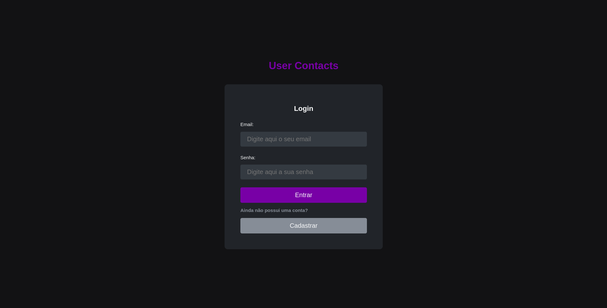
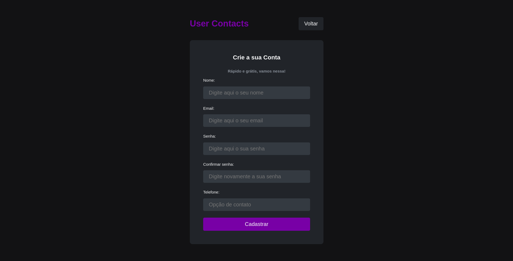
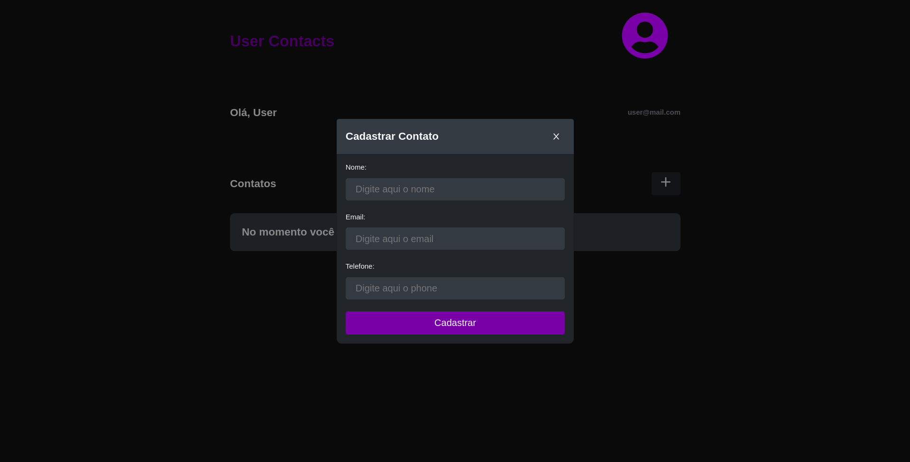

# Documentation

## Table of Contents

- [Overview](#1-overview)
- [Quick Start](#2-quick-start)
  - [Clone repository](#21-clone-this-repository)
  - [Install the dependencies](#22-install-the-dependencies)
  - [Run the project](#23-run-the-project)
- [Quick Start Using Docker](#3-quick-start-using-docker)
  - [Clone repository](#31-clone-this-repository)
  - [Settings for running docker](#32-settings-for-running-docker)
- [Endpoints](#5-endpoints)

---

## 1. Overview

 Implementation of the [API](https://github.com/leandroschillreff/back-end-user-contacts.git) front end for registering users and contacts, some of the technologies used.

- [NodeJS](https://nodejs.org/en/)
- [ReactJS](https://pt-br.reactjs.org/)
- [TypeScript](https://www.typescriptlang.org/)
- [React Hot Toast](https://react-hot-toast.com/)
- [Axios](https://axios-http.com/ptbr/)
- [Yup](https://www.npmjs.com/package/yup)
- [React Hook Form](https://react-hook-form.com/)
- [React Router](https://reactrouter.com/en/main)
- [React Icons](https://react-icons.github.io/react-icons/)

## 1.1 Login

<p align="center">
    
</p>

## 1.2 Register

<p align="center">
    
</p>

## 1.3 DashBoard

<p align="center">
    
</p>

---

## 2. Quick Start

[Back to the top](#table-of-contents)

### 2.1 Clone this repository

```shell
git clone https://github.com/leandroschillreff/front-end-user-contacts.git
cd back-end-user-contacts
```

### 2.2 Install the dependencies

```shell
yarn
```

### 2.3 Run the project

```shell
yarn start
```

---

## 3 Quick Start Using Docker

[Back to the top](#table-of-contents)

### 3.1 Clone this repository

```shell
git clone https://github.com/leandroschillreff/front-end-user-contacts.git
cd back-end-user-contacts
```

### 3.2 Settings for running docker

1. To start and restart all services defined in docker-compose.yml

    ```shell
    docker-compose up
    ```

    ```shell
    sudo docker-compose up
    ```

2. To stop all services defined in docker-compose.yml

    ```shell
    docker-compose stop
    ```

    ```shell
    sudo docker-compose stop
    ```

3. To restart the previously stopped containers

    ```shell
    docker-compose start
    ```

    ```shell
    sudo docker-compose start
    ```

4. To stop container execution, and will remove stopped containers

    ```shell
    docker-compose down
    ```

    ```shell
    sudo docker-compose down
    ```

---

## 5 Endpoints

[Back to the top](#table-of-contents)

### 5.1 <http://127.0.0.1:3000/>

---
